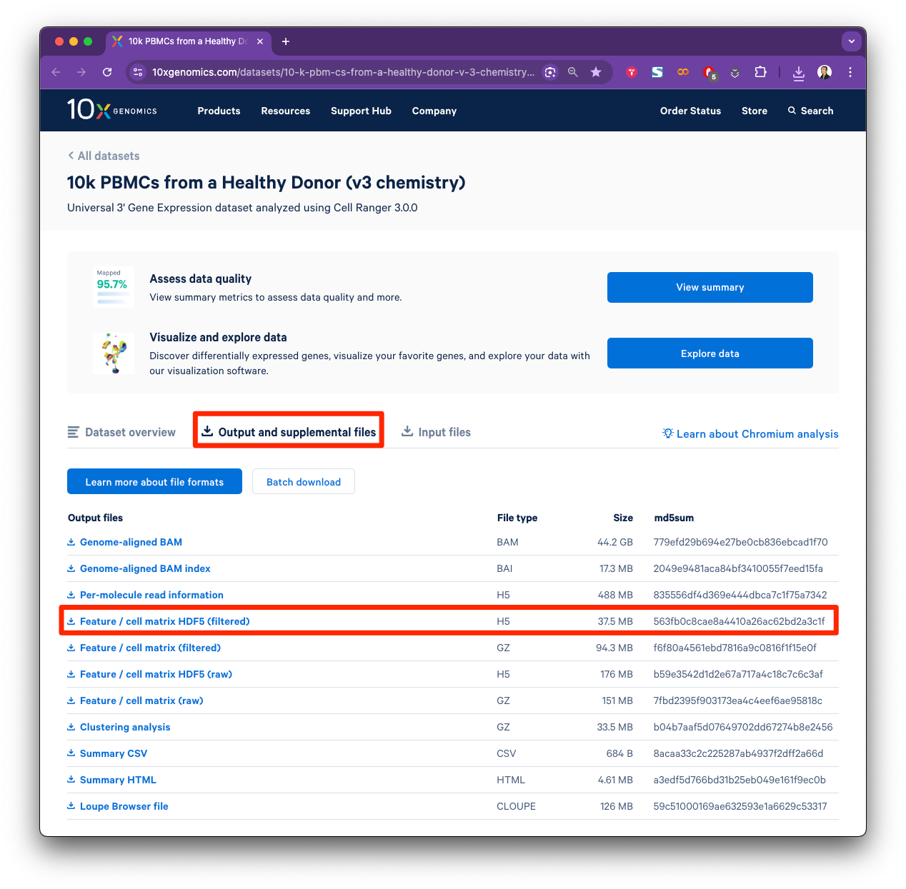

# Single Cell Genomics Workshop F2025

## Setup

### Prerequisites

For a smooth installation, ensure that your machine is running Miniconda version `25.5.1` or later.

### Mac

The following setup instructions were validated on a Mac with an Apple M2 chip, using Miniconda version `25.5.1`.

```bash
conda create -n scgw_f25 python=3.12 pip jupyterlab
conda activate scgw_f25

conda install -c conda-forge scanpy leidenalg python-igraph jaxlib jax conda-forge::scvi-tools bioconda::gseapy conda-forge::hnswlib conda-forge::python-annoy
pip install scrublet scimilarity Cython
```

### Windows

The following setup instructions were validated on a Windows 11, using Miniconda version `25.7.0`.

```bash
conda create -n scgw_f25 python=3.12 pip jupyterlab
conda activate scgw_f25

conda install -c conda-forge scanpy leidenalg python-igraph jaxlib jax conda-forge::hnswlib conda-forge::python-annoy
pip install scrublet gseapy scvi-tools scimilarity Cython
```

### Verify Installation

Please run the following command and ensure that each item is successfully verified and marked as complete ✅.

```bash
python check_env.py
```

## Sample Dataset

We will be using a public dataset from [10x Genomics](https://www.10xgenomics.com/datasets/10-k-pbm-cs-from-a-healthy-donor-v-3-chemistry-3-standard-3-0-0) that contains about 11 thousand peripheral blood mononuclear cells (PBMCs) from a healthy donor. The dataset can be downloaded from [here](https://cf.10xgenomics.com/samples/cell-exp/3.0.0/pbmc_10k_v3/pbmc_10k_v3_filtered_feature_bc_matrix.h5). You can also use `wget` or `curl` to download the file from the command line.

```bash
wget https://cf.10xgenomics.com/samples/cell-exp/3.0.0/pbmc_10k_v3/pbmc_10k_v3_filtered_feature_bc_matrix.h5
```

