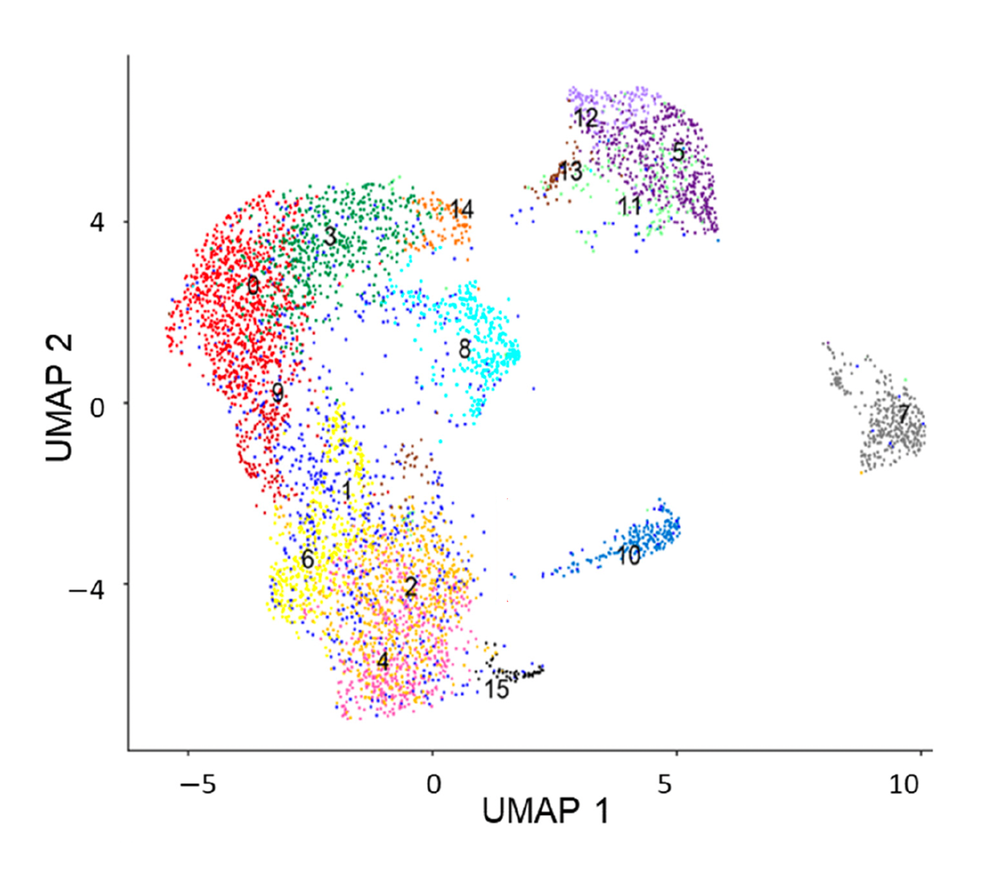

_Copyright Notice_

Jaeyoung Chun | School of Applied Artificial Intelligence | Handong Global University

## Mini-Project: Single-Cell Transcriptomic Analysis of Circulating Tumor Cell Heterogeneity

This mini-project is designed to apply the single-cell RNA sequencing (scRNA-seq) analysis concepts and methods learned in this workshop to a real-world biological problem: characterizing the heterogeneity of Circulating Tumor Cells (CTCs) in breast cancer. CTCs are of critical importance as they are the cellular link between the primary tumor and distant metastasis.

The project is based on the study: **"Heterogeneity of Circulating Tumor Cell Neoplastic Subpopulations Outlined by Single-Cell Transcriptomics"** (PMCID: PMC8508335  PMID: 34638368).

Link: https://pmc.ncbi.nlm.nih.gov/articles/PMC8508335/

The goal is to analyze single-cell transcriptomics data from breast cancer patients, which includes both CTCs and various peripheral blood mononuclear cells (PBMCs), to identify the CTC population, characterize its gene expression profile, and explore its heterogeneity.

***

### 1. Data Acquisition and Initial Processing

**Task:** Download the raw count matrices and any necessary metadata from the study associated with PMC8508335.

**Output:**
* A brief description of where the data was located and the format of the downloaded files (e.g., `.mtx` file, `barcodes.tsv`, `features.tsv`).
* The code or steps used to load the data into the chosen scRNA-seq analysis environment (e.g. AnnData object using Scanpy).

***

### 2. Dimensionality Reduction and Cell Clustering

**Task:** Process the raw data through the standard scRNA-seq pipeline to visualize the cell populations.

1.  **Quality Control (QC):** Filter cells based on metrics like minimum and maximum gene counts, total UMI counts, and mitochondrial gene percentage. Justify the chosen thresholds.
2.  **Normalization and Scaling:** Normalize the raw counts (e.g., $\log$-normalization) and scale the data.
3.  **Highly Variable Genes (HVGs) Selection:** Identify HVGs to focus on the most informative genes.
4.  **Dimensionality Reduction:** Perform **Principal Component Analysis (PCA)** to reduce dimensions, followed by **Uniform Manifold Approximation and Projection (UMAP)** for 2D visualization.
5.  **Clustering:** Apply a graph-based clustering algorithm (e.g., Louvain or Leiden) to group cells into distinct clusters.

**Output:**
* A summary table of QC metrics before and after filtering.
* A **UMAP plot** of the clustered cells, with each cluster clearly distinguishable by color, labeled with its assigned cluster number (0-N).
* **Identify the CTC Cluster:** By visually comparing your generated UMAP plot with Figure 4 from the original paper, identify which of your clusters corresponds to the Circulating Tumor Cells (CTCs) (highlighted in the red box, labeled as **Cluster 10** in the paper's figure).

***

### 3. Cell Type Annotation and Differential Expression

**Task:** Annotate the identified clusters with cell types, with a specific focus on the CTC cluster.

1.  **Marker Identification:** Perform **Differential Expression (DE)** analysis to find **cluster-specific marker genes** for *all* clusters, especially the identified CTC cluster.
2.  **Cell Type Annotation:** Assign an identity (e.g., T Cells, Monocytes, CTCs) to each cluster based on the expression of known lineage markers (e.g., *CD3D/CD3E* for T cells, *CD14/LYZ* for Monocytes, and epithelial markers for CTCs, as discussed in the workshop and paper).

**Output:**
* A list of the top 5-10 differentially expressed marker genes for the putative CTC cluster, and for a major immune cell cluster (e.g., T Cells).
* An explanation of the logic used to annotate the CTC cluster, citing key marker genes. **Classical CTC definition markers** (*EPCAM*, Cytokeratins, absence of *PTPRC/CD45*) should be checked, as well as the unique markers identified in the study.
* A **Violin Plot** demonstrating the expression level of key CTC markers (e.g., *EPCAM*, *CLDN7*, *TACSTD2*, *MGP*) across all clusters. This should aim to reproduce the characteristic expression pattern shown in Figure 6.
    * *Self-Correction/Critical Thinking:* Compare your results to the genes listed in the paper and discuss any similarities or discrepancies.

***

### 4. Characterization of CTC Gene Expression Signature

**Task:** Define the set of genes that distinguish the CTC population from the non-tumor/immune cells.

1.  **Define Signature Genes:** Perform a $\text{log}_2$-fold change ($\text{logFC}$) and adjusted $p$-value-based differential expression analysis to find genes significantly upregulated in the **CTC cluster** compared to **all other cell clusters combined** (non-CTCs).
2.  **Visualization:** Generate a **volcano plot** or a **heatmap** to visualize the differentially expressed genes (DEGs) between CTCs and non-CTCs.

**Output:**
* A list of the **top 20 most significantly upregulated genes** in the CTC cluster (based on high $\text{logFC}$ and low adjusted $p$-value).
* The generated visualization (volcano plot or heatmap).
* A discussion on the biological function or significance of a few of the most highly expressed, novel genes found in the CTC cluster, potentially suggesting why they might be important for CTC biology (e.g., cell adhesion, survival, or metastasis).

***

### Submission and Presentation

Students will submit a report containing all generated plots, tables, code snippets, and explanations for each section. An optional five-minute presentation of the findings could also be requested. This project will test the student's ability to execute a full scRNA-seq workflow and critically interpret the biological results.
